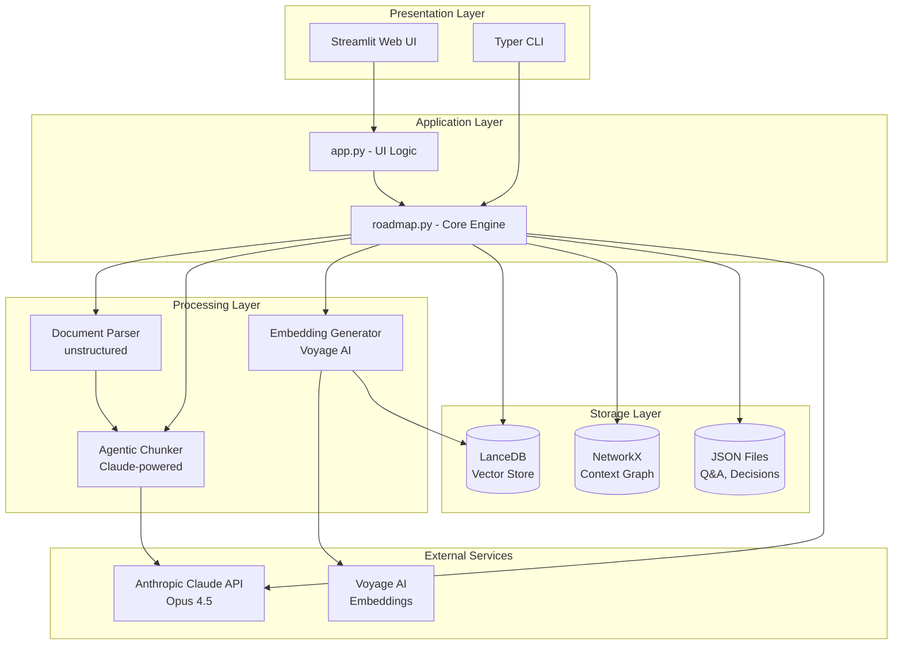
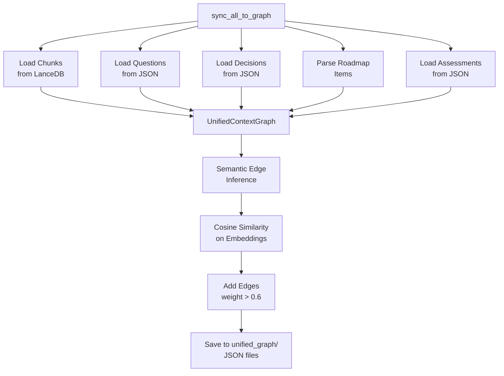
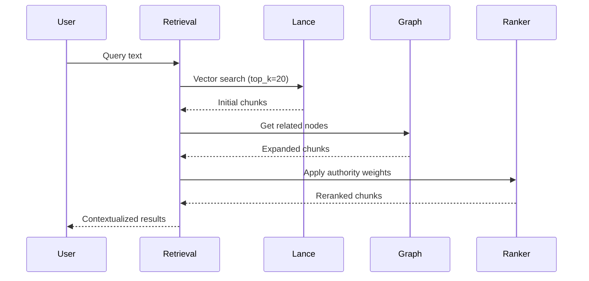
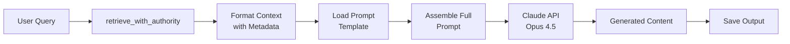
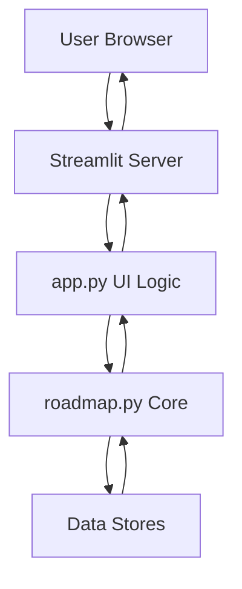
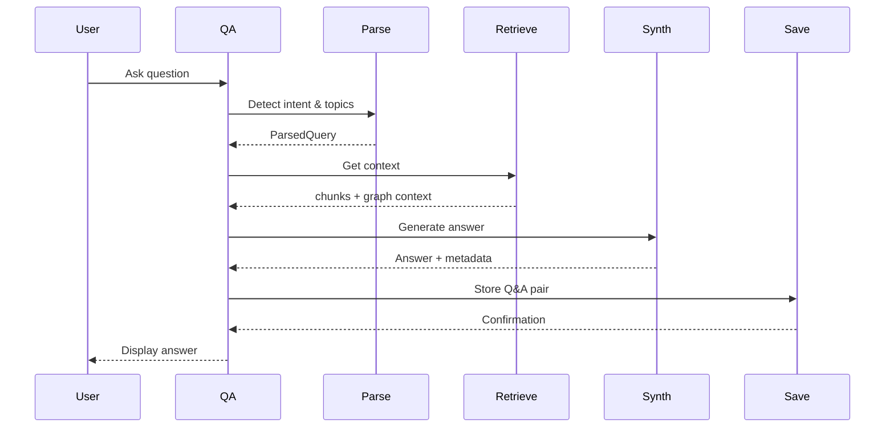
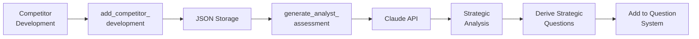
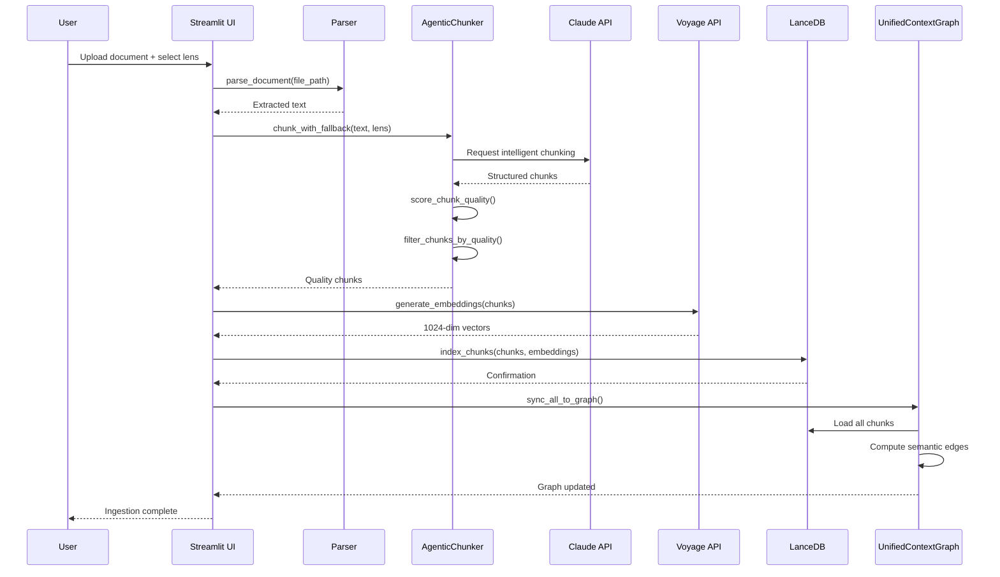
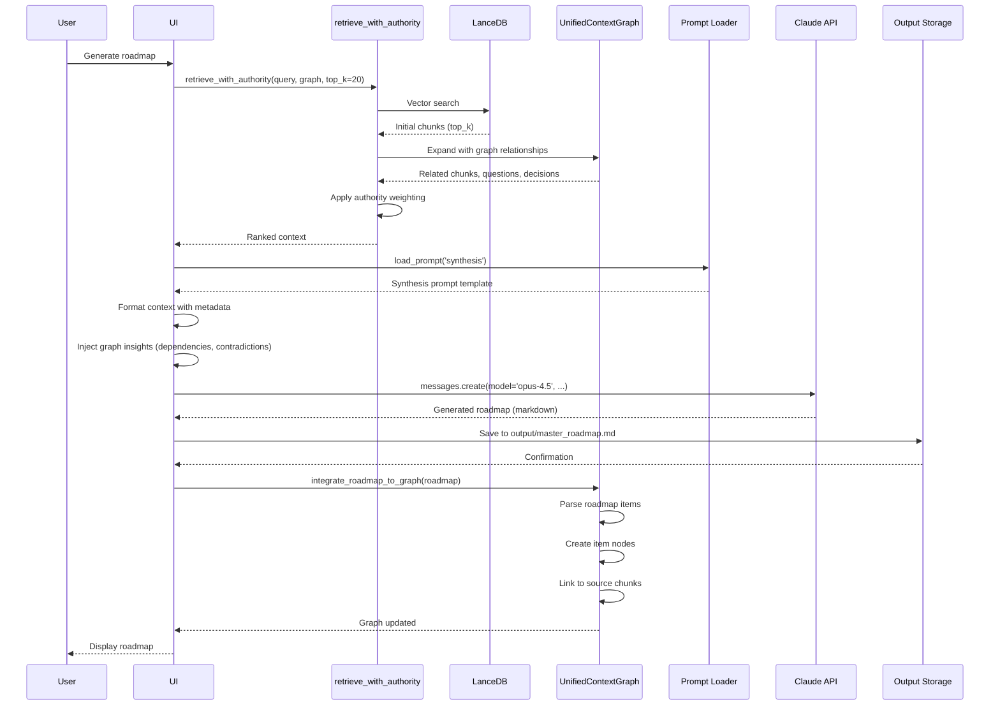
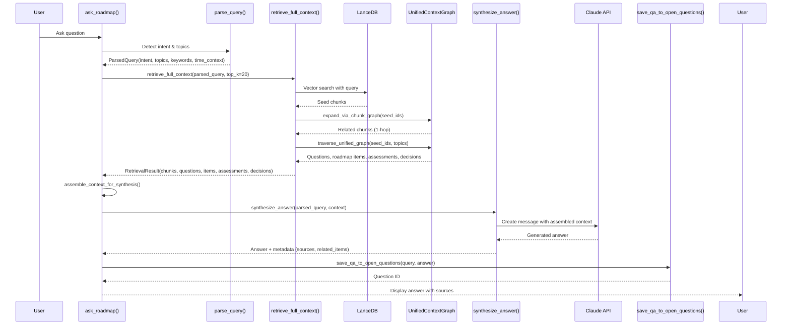

# Architecture Review: Roadmap Synthesis Tool

**Review Date:** 2026-01-07
**Reviewer:** Claude Code
**Codebase Version:** fd057bc (Implement semantic edge inference using embedding-based similarity)

---

## Executive Summary

The Roadmap Synthesis Tool is a sophisticated Python-based application that synthesizes diverse strategic documents into persona-specific product roadmaps using semantic search, knowledge graphs, and Claude AI. The system ingests multi-format documents (PDF, DOCX, PPTX, XLSX, etc.), applies lens-based authority tagging to organize sources by credibility, and uses vector-based retrieval with LLM synthesis to generate coherent roadmaps tailored for executives, product managers, or engineers.

The architecture demonstrates strong engineering practices with a unified context graph for relationship management, semantic edge inference for intelligent retrieval, and a comprehensive web interface built with Streamlit. The codebase is well-organized with clear separation of concerns between CLI (roadmap.py), UI (app.py), and supporting infrastructure. Recent commits show active development focused on improving graph-based retrieval and Q&A capabilities.

Critical findings indicate the system is production-ready for internal use but requires comprehensive test coverage, better error handling, and scalability improvements before wider deployment. The "agentic chunking" approach and sophisticated authority-based retrieval demonstrate innovative solutions to document synthesis challenges.

### Key Metrics

| Metric | Value |
|--------|-------|
| Total Source Files | 6 Python files |
| Lines of Code | ~10,260 (app.py: 5,617, roadmap.py: 4,513) |
| External Dependencies | 9 major packages |
| API Integrations | 2 (Anthropic Claude, Voyage AI) |
| Data Stores | 2 (LanceDB vector store, NetworkX graph) |
| Test Coverage | 0% (no automated tests) |

### Critical Findings

1. **Zero Test Coverage** - No unit, integration, or end-to-end tests exist, creating significant risk for maintenance and refactoring
2. **Missing Error Handling** - API failures, rate limits, and network issues not comprehensively handled
3. **Performance Bottlenecks** - Large file processing (5,617-line files) without chunking or streaming; synchronous API calls without batching

---

## System Overview

### Purpose

The Roadmap Synthesis Tool helps product leaders and strategists consolidate fragmented strategic information across multiple document types and organizational sources into unified, actionable roadmaps. Users organize documents by "lens" (authority level), and the system synthesizes them respecting a predefined hierarchy where engineering has veto power and conversational sources reveal truth over formal documentation.

The system addresses the challenge of scattered strategic knowledge across slides, docs, meeting transcripts, and external analyst reports by creating a queryable knowledge base with intelligent retrieval and LLM-powered synthesis.

### Architecture Diagram



### Technology Stack

| Layer | Technology |
|-------|------------|
| Language | Python 3.13 |
| CLI Framework | Typer + Rich |
| Web Framework | Streamlit 1.52 |
| LLM | Anthropic Claude Opus 4.5 |
| Embeddings | Voyage AI (voyage-3-large) |
| Vector Database | LanceDB 0.26 |
| Graph Database | NetworkX 3.6 |
| Document Parser | unstructured 0.18 (with all-docs) |
| Token Counter | tiktoken 0.12 |
| Environment | python-dotenv |

### Directory Structure

```
roadmap-synth/
├── app.py                         # Streamlit web interface (5,617 lines)
├── main.py                        # Stub entry point (6 lines)
├── roadmap.py                     # Core CLI and processing engine (4,513 lines)
├── test_*.py                      # Test/diagnostic scripts (3 files)
│
├── prompts/                       # LLM prompt templates
│   ├── synthesis.md               # Master synthesis framework (529 lines)
│   └── personas/
│       ├── executive.md           # Executive formatting (77 lines)
│       ├── product.md             # Product manager formatting (108 lines)
│       └── engineering.md         # Engineering formatting (146 lines)
│
├── materials/                     # Source documents organized by lens
│   ├── your-voice/                # Strategic vision (highest authority)
│   ├── team-conversational/       # Meeting notes, discussions
│   ├── team-structured/           # Official team docs
│   ├── sales-conversational/      # Sales insights
│   ├── business-framework/        # OKRs, business strategy
│   ├── engineering/               # Technical docs (veto power)
│   └── external-analyst/          # Market research (lowest authority)
│
├── output/                        # Generated roadmaps
│   ├── master_roadmap.md
│   ├── executive_roadmap.md
│   ├── product_roadmap.md
│   ├── engineering_roadmap.md
│   └── competitive/               # Competitive intelligence
│
├── data/                          # Runtime data stores
│   ├── roadmap_chunks.lance/      # Vector database (7.8 MB)
│   ├── context_graph.json         # Legacy graph format (28 MB)
│   ├── unified_graph/             # New unified graph structure
│   │   ├── chunk_nodes.json       # Chunk metadata (2.7 MB)
│   │   ├── roadmap_item_nodes.json
│   │   ├── question_nodes.json
│   │   ├── assessment_nodes.json
│   │   ├── decision_nodes.json
│   │   ├── gap_nodes.json
│   │   └── graph.json             # NetworkX graph (8 MB)
│   └── questions/                 # Q&A storage
│
├── pyproject.toml                 # Project dependencies
├── .env.example                   # API key template
└── README.md                      # User documentation (320 lines)
```

---

## Component Deep Dive

### Component 1: Document Ingestion Pipeline

**Purpose:** Parse multi-format documents, chunk intelligently, and index with embeddings

**Location:** `roadmap.py` lines 91-868

**Key Functions:**

| Function | Purpose | Status |
|----------|---------|--------|
| `parse_document()` | Parse docs using unstructured library | ✅ |
| `chunk_with_fallback()` | Agentic chunking with Claude fallback | ✅ |
| `AgenticChunker` class | Smart document chunking with LLM | ✅ |
| `structure_aware_chunk()` | Detect structure and chunk accordingly | ✅ |
| `score_chunk_quality()` | Quality scoring for chunk filtering | ✅ |
| `verify_chunk_integrity()` | Validate chunk completeness | ✅ |
| `index_chunks()` | Store chunks in LanceDB with embeddings | ✅ |

**Dependencies:**
- Depends on: unstructured (parsing), Anthropic Claude (agentic chunking), Voyage AI (embeddings)
- Depended on by: CLI ingest command, Web UI ingest page

**Data Flow:**


**Issues Identified:**
- ⚠️ **No retry logic** for API failures during chunking or embedding
- ⚠️ **Synchronous processing** - large documents processed serially, could parallelize
- ⚠️ **Memory concerns** - loads entire document in memory before chunking
- ⚠️ **Limited error recovery** - failed chunks abort entire ingestion
- ✅ **Fallback chunking** - good resilience with simple chunking if LLM fails

**Notable Design Decision:**
The "agentic chunking" approach (roadmap.py:499-699) uses Claude to intelligently chunk documents by understanding content structure. This is innovative but expensive (~$0.10-0.50 per 100 pages). The system includes quality scoring and a fallback to simple token-based chunking if Claude is unavailable.

---

### Component 2: UnifiedContextGraph

**Purpose:** Maintain semantic relationships between chunks, questions, decisions, roadmap items, and assessments

**Location:** `roadmap.py` lines 2877-3408

**Key Functions:**

| Function | Purpose | Status |
|----------|---------|--------|
| `UnifiedContextGraph.__init__()` | Initialize graph structure | ✅ |
| `add_node()` | Add typed nodes to graph | ✅ |
| `add_edge()` | Create relationships with metadata | ✅ |
| `sync_all_to_graph()` | Rebuild graph from all sources | ✅ |
| `retrieve_with_authority()` | Authority-based retrieval | ✅ |
| `integrate_*_to_graph()` | Integrate various entity types | ✅ |
| `save()` / `load()` | Persistence to JSON | ✅ |

**Dependencies:**
- Depends on: NetworkX (graph operations), LanceDB (chunk vectors), JSON files (persistence)
- Depended on by: Retrieval system, Q&A system, roadmap generation

**Data Flow:**


**Issues Identified:**
- ⚠️ **Large in-memory graph** - 987 chunks + all relationships loaded into memory
- ⚠️ **Slow sync operation** - Processing all embeddings for semantic edges is O(n²)
- ⚠️ **No incremental updates** - entire graph rebuilt on each sync
- ⚠️ **JSON persistence** - 8 MB graph.json file, slow load/save
- ✅ **Semantic edge inference** - Recent improvement (fd057bc) uses cosine similarity > 0.6 threshold

**Notable Design Decision:**
The unified graph replaces an earlier "ContextGraph" implementation. It uses semantic similarity (cosine similarity on embeddings) to infer edges between chunks and roadmap items, going beyond keyword matching. This allows discovery of conceptually related content even without lexical overlap.

---

### Component 3: Authority-Based Retrieval System

**Purpose:** Retrieve relevant context with authority-level weighting for synthesis

**Location:** `roadmap.py` lines 1173-1311, 3297-3408

**Key Functions:**

| Function | Purpose | Status |
|----------|---------|--------|
| `retrieve_chunks()` | Basic semantic retrieval | ✅ |
| `retrieve_balanced()` | Balanced retrieval across lenses | ✅ |
| `retrieve_with_graph_expansion()` | Graph-expanded retrieval | ✅ |
| `retrieve_with_authority()` | Authority-weighted retrieval | ✅ |
| `detect_potential_contradictions()` | Find conflicting chunks | ✅ |

**Authority Hierarchy (highest to lowest):**
1. **your-voice** (10.0) - Strategic vision
2. **team-conversational** (8.0) - Real priorities
3. **team-structured** (6.0) - Formal docs
4. **sales-conversational** (5.5) - Sales insights
5. **business-framework** (5.0) - Business strategy
6. **engineering** (Veto power, weight 7.0) - Technical feasibility
7. **external-analyst** (2.0) - Market validation

**Dependencies:**
- Depends on: LanceDB (vector search), UnifiedContextGraph (relationship expansion)
- Depended on by: Roadmap generation, Q&A system, persona formatting

**Data Flow:**


**Issues Identified:**
- ✅ **Well-designed authority system** - Clear hierarchy with engineering veto power
- ✅ **Graph expansion** - Uses relationships to find related content
- ⚠️ **Fixed top_k=20** - No dynamic adjustment based on query complexity
- ⚠️ **No query decomposition** - Complex queries not broken into sub-queries
- ⚠️ **Limited contradiction detection** - Only finds conflicting chunks, doesn't resolve

---

### Component 4: LLM Synthesis Engine

**Purpose:** Generate roadmaps and answers using Claude with retrieved context

**Location:** `roadmap.py` lines 1414-1565, app.py lines 2405-2605

**Key Functions:**

| Function | Purpose | Status |
|----------|---------|--------|
| `generate_roadmap()` | Master roadmap synthesis | ✅ |
| `format_for_persona()` | Persona-specific formatting | ✅ |
| `synthesize_answer()` | Q&A answer generation | ✅ |
| `generate_architecture_alignment()` | Architecture analysis | ✅ |
| `generate_analyst_assessment()` | Competitive assessment | ✅ |

**Dependencies:**
- Depends on: Anthropic Claude API (Opus 4.5), retrieval system, prompt templates
- Depended on by: All generation commands, Q&A interface

**Data Flow:**


**Issues Identified:**
- ⚠️ **No streaming** - Long responses wait for full completion
- ⚠️ **No token tracking** - Costs not monitored or reported
- ⚠️ **Fixed model** - No fallback to Sonnet/Haiku for simpler queries
- ⚠️ **No caching** - Identical queries regenerate responses
- ⚠️ **Limited error handling** - API errors not gracefully handled
- ✅ **Excellent prompts** - synthesis.md is a 529-line masterclass in prompt engineering
- ✅ **Persona templates** - Well-structured formatting for different audiences

**Notable Design Decision:**
The synthesis prompt (prompts/synthesis.md) implements a two-phase process: (1) synthesize roadmap from team inputs, (2) validate against strategic vision. This prevents "your-voice" from dictating the roadmap while ensuring alignment checks. The prompt is sophisticated with explicit rules for handling contradictions, dependencies, and cross-team coordination.

---

### Component 5: Streamlit Web Interface

**Purpose:** User-friendly web UI for all features

**Location:** `app.py` (5,617 lines)

**Key Pages:**

| Page | Purpose | Status |
|------|---------|--------|
| `page_dashboard()` | Overview, stats, quick actions | ✅ |
| `page_ingest()` | Document upload and ingestion | ✅ |
| `page_manage()` | Material and chunk management | ✅ |
| `page_chunks()` | Chunk browser and inspector | ✅ |
| `page_chunking_audit()` | Quality audit of chunks | ✅ |
| `page_context_graph()` | Graph visualization and query | ✅ |
| `page_generate()` | Roadmap generation | ✅ |
| `page_format()` | Persona formatting | ✅ |
| `page_ask()` | Q&A interface | ✅ |
| `page_open_questions()` | Question management | ✅ |
| `page_architecture_alignment()` | Architecture analysis | ✅ |
| `page_competitive_intelligence()` | Competitive tracking | ✅ |
| `page_settings()` | API keys and configuration | ✅ |

**Dependencies:**
- Depends on: Streamlit, roadmap.py (all functions), pandas (data display)
- Depended on by: End users

**Data Flow:**


**Issues Identified:**
- ⚠️ **5,617 lines in single file** - Should be modularized into page files
- ⚠️ **Session state management** - Limited use of Streamlit session state
- ⚠️ **No authentication** - Anyone with URL can access
- ⚠️ **No multi-user support** - Single index shared across users
- ⚠️ **Limited responsiveness** - UI designed for desktop, mobile experience not optimized
- ✅ **Comprehensive features** - All CLI capabilities available in UI
- ✅ **Good UX patterns** - Expandable sections, tabs, progress indicators
- ✅ **Diagnostic tools** - Built-in graph diagnostics and chunk auditing

---

### Component 6: Q&A System with Holistic Question Generation

**Purpose:** Answer questions about roadmap materials and generate strategic questions from gaps

**Location:** `app.py` lines 1883-2877

**Key Functions:**

| Function | Purpose | Status |
|----------|---------|--------|
| `ask_roadmap()` | Main Q&A entry point | ✅ |
| `parse_query()` | Intent detection and parsing | ✅ |
| `retrieve_full_context()` | Context retrieval with graph traversal | ✅ |
| `synthesize_answer()` | Answer generation with Claude | ✅ |
| `generate_questions_holistic()` | Generate questions from gaps | ✅ |
| `derive_questions_from_graph()` | Graph-based question generation | ✅ |
| `mark_obsolete_questions()` | Question lifecycle management | ✅ |

**Dependencies:**
- Depends on: UnifiedContextGraph, retrieve system, Claude API
- Depended on by: Ask page, Open Questions page

**Data Flow:**


**Issues Identified:**
- ✅ **Intelligent query parsing** - Detects intent (factual, compare, planning, gap, contradiction)
- ✅ **Graph-aware retrieval** - Traverses unified graph for context
- ✅ **Question generation** - Derives questions from gaps and contradictions
- ⚠️ **No answer confidence scoring** - Can't tell user if answer is uncertain
- ⚠️ **Limited source attribution** - Shows sources but not which sentences came from where
- ⚠️ **No follow-up support** - Each question independent, no conversation threading

**Notable Design Decision:**
The system includes sophisticated "holistic question generation" (app.py:1883-1955) that analyzes the graph for contradictions, isolated nodes, and gaps to automatically suggest questions that need answering. This proactive approach helps users identify strategic uncertainties.

---

### Component 7: Competitive Intelligence Module

**Purpose:** Track competitor developments and generate strategic assessments

**Location:** `roadmap.py` lines 2314-2876, app.py page_competitive_intelligence()

**Key Functions:**

| Function | Purpose | Status |
|----------|---------|--------|
| `add_competitor_development()` | Log competitor moves | ✅ |
| `generate_analyst_assessment()` | Generate strategic assessment | ✅ |
| `format_analyst_assessment_markdown()` | Format for display | ✅ |
| `add_strategic_questions_to_system()` | Derive questions from assessments | ✅ |

**Dependencies:**
- Depends on: JSON storage, Claude API, UnifiedContextGraph
- Depended on by: Competitive Intelligence page

**Data Flow:**


**Issues Identified:**
- ✅ **Good structure** - Captures development with metadata
- ✅ **Strategic assessment** - Analyzes impact on roadmap
- ⚠️ **Manual entry only** - No automated competitor tracking
- ⚠️ **No trend analysis** - Doesn't identify patterns across multiple developments
- ⚠️ **Limited validation** - Doesn't verify against external-analyst lens documents

---

## Data Models

### Model 1: Chunk

```python
{
    "id": "string (source_file_path_chunk_index)",
    "content": "string (text content)",
    "lens": "enum (your-voice|team-structured|...)",
    "source_file": "string (file path)",
    "source_name": "string (optional display name)",
    "chunk_index": "integer",
    "token_count": "integer",
    "key_terms": ["string", ...],  # Optional
    "time_refs": ["string", ...],  # Optional
    "created_at": "timestamp",
    "vector": [float, ...]  # 1024-dimensional embedding
}
```

**Relationships:**
- Belongs to: Source document
- Connected to: Other chunks (via UnifiedContextGraph semantic edges)
- Referenced by: Questions, roadmap items, assessments

**Validation:**
- `lens` must be one of 7 valid lenses
- `token_count` typically 100-1500 tokens
- `vector` length = 1024 (Voyage AI embedding dimension)
- Quality score calculated on creation (0.0-1.0)

---

### Model 2: Question

```python
{
    "id": "string (q_[audience]_[uuid])",
    "question": "string",
    "audience": "enum (engineering|leadership|product|general)",
    "category": "string (feasibility|investment|direction|...)",
    "context": "string (why this matters)",
    "source_tensions": "string (what prompted this)",
    "related_roadmap_items": ["string", ...],
    "priority": "enum (critical|high|medium|low)",
    "suggested_deadline": "string",
    "status": "enum (open|in_progress|answered|obsolete)",
    "created_at": "timestamp",
    "answered_at": "timestamp (optional)",
    "answer": "string (optional)",
    "answer_summary": "string (optional)",
    "sources_used": [{"chunk_id": "...", "weight": float}, ...],
    "is_accurate": "boolean (optional validation)",
    "validated_by": "string (optional)",
    "feedback_note": "string (optional)"
}
```

**Relationships:**
- Generated from: Roadmap synthesis, gap analysis, or user query
- Linked to: Chunks (sources), roadmap items
- Has node in: UnifiedContextGraph

**Validation:**
- `audience` restricted to 4 values
- `priority` determines urgency
- Questions can be marked obsolete as context changes

---

### Model 3: Roadmap Item

```python
{
    "id": "string (generated from name)",
    "name": "string",
    "description": "string",
    "customer_value": "string (optional)",
    "business_impact": "string (optional)",
    "owner": "string (optional)",
    "effort": "string (optional T-shirt size)",
    "dependencies": ["string", ...],
    "source_lenses": ["string", ...],
    "horizon": "enum (now|next|later|future)",
    "created_at": "timestamp"
}
```

**Relationships:**
- Extracted from: Generated master roadmap
- Connected to: Chunks (via semantic edges in graph)
- Referenced by: Questions, assessments

---

### Model 4: Assessment

```python
{
    "id": "string (assess_[type]_[uuid])",
    "assessment_type": "enum (competitive|architecture|strategic)",
    "title": "string",
    "summary": "string",
    "impact_analysis": "string",
    "recommendations": ["string", ...],
    "roadmap_impacts": [
        {
            "roadmap_item": "string",
            "impact_type": "enum (opportunity|threat|validation|conflict)",
            "severity": "enum (critical|high|medium|low)",
            "description": "string"
        }
    ],
    "questions_raised": ["string (question_ids)", ...],
    "created_at": "timestamp",
    "development_ref": "string (optional, for competitive)"
}
```

**Relationships:**
- Generated from: Competitive developments, architecture alignment
- Linked to: Roadmap items, questions, competitor developments
- Has node in: UnifiedContextGraph

---

### Model 5: Decision

```python
{
    "id": "string (decision_[uuid])",
    "title": "string",
    "context": "string",
    "decision": "string",
    "rationale": "string",
    "alternatives_considered": ["string", ...],
    "stakeholders": ["string", ...],
    "implications": "string",
    "created_at": "timestamp",
    "created_by": "string"
}
```

**Relationships:**
- Created by: Users logging decisions
- Linked to: Questions that prompted decision
- Has node in: UnifiedContextGraph
- Used by: Synthesis to respect past decisions

---

## Data Flow Analysis

### Flow 1: Document Ingestion



**Steps:**
1. User uploads file via UI or CLI, selects lens (authority level)
2. `parse_document()` uses unstructured library to extract text from any format
3. `AgenticChunker` sends text to Claude with instructions for intelligent chunking
4. Claude returns semantically meaningful chunks with metadata
5. Each chunk scored for quality (0.0-1.0), low-quality chunks filtered
6. Chunks embedded using Voyage AI (voyage-3-large model)
7. Chunks + embeddings stored in LanceDB with metadata
8. UnifiedContextGraph updated with new chunks as nodes
9. Semantic edges computed between new chunks and existing nodes (cosine similarity > 0.6)
10. Graph persisted to unified_graph/ JSON files

**Error Handling:**
- Parse failure: Skip file, warn user
- Claude chunking failure: Fall back to simple token-based chunking
- Embedding failure: Retry once, then fail ingestion
- Quality score < 0.3: Chunk filtered out, logged

---

### Flow 2: Roadmap Generation



**Steps:**
1. User initiates roadmap generation (default query: "Generate a comprehensive product roadmap")
2. Query embedded and used for vector search in LanceDB (top_k=20 initial chunks)
3. UnifiedContextGraph expanded: follow edges to related chunks, questions, decisions
4. Authority weights applied based on lens hierarchy
5. Context formatted with lens attribution, key terms, time references
6. Synthesis prompt loaded (prompts/synthesis.md - 529 lines)
7. Prompt injected with retrieved context, graph insights (dependencies, contradictions)
8. Claude Opus 4.5 generates comprehensive roadmap following template
9. Roadmap saved to output/master_roadmap.md
10. Roadmap parsed to extract individual items
11. Items added as nodes to UnifiedContextGraph
12. Semantic edges created from items to supporting chunks (similarity > 0.6)
13. Graph saved

**Error Handling:**
- Empty retrieval: Use all chunks (fallback)
- Claude API failure: Retry with exponential backoff (not implemented - ⚠️ issue)
- Parse failure: Save raw response, warn user

---

### Flow 3: Q&A with Holistic Context



**Steps:**
1. User enters question in Q&A interface
2. Query parsed to detect intent (factual, compare, planning, gap, contradiction)
3. Topics extracted using NLP heuristics
4. Keywords and time context extracted
5. Vector search retrieves seed chunks (semantic similarity)
6. Graph traversal expands to related chunks (1-hop in chunk graph)
7. Unified graph traversed to find related questions, roadmap items, assessments, decisions
8. Context assembled with chunks first, then graph entities
9. Claude generates answer using context
10. Answer includes source attribution and related items
11. Q&A pair saved to questions/questions.json
12. If user opts in, question added to Open Questions system for tracking
13. Answer displayed with expandable source references

**Error Handling:**
- No results: Fall back to broader search or suggest query refinement
- Graph traversal failure: Continue with chunk results only
- Claude failure: Retry once, show error message

---

## Current Capabilities Matrix

| Feature | Status | Notes |
|---------|--------|-------|
| **Document Ingestion** | | |
| Multi-format parsing | ✅ Complete | PDF, DOCX, PPTX, XLSX, CSV, MD, TXT, JSON |
| Agentic chunking | ✅ Complete | LLM-powered intelligent chunking |
| Fallback chunking | ✅ Complete | Token-based chunking if LLM unavailable |
| Chunk quality scoring | ✅ Complete | Filters low-quality chunks |
| Chunk integrity verification | ✅ Complete | Validates completeness |
| Lens-based organization | ✅ Complete | 7 authority levels |
| **Vector Search** | | |
| Embedding generation | ✅ Complete | Voyage AI voyage-3-large |
| Vector indexing | ✅ Complete | LanceDB |
| Semantic retrieval | ✅ Complete | Cosine similarity search |
| Balanced retrieval | ✅ Complete | Ensures lens diversity |
| Authority-weighted ranking | ✅ Complete | Respects lens hierarchy |
| **Knowledge Graph** | | |
| UnifiedContextGraph | ✅ Complete | NetworkX-based multi-entity graph |
| Semantic edge inference | ✅ Complete | Recent improvement (fd057bc) |
| Graph persistence | ✅ Complete | JSON-based save/load |
| Graph traversal | ✅ Complete | Multi-hop relationship following |
| Contradiction detection | ⚠️ Partial | Finds contradictions, doesn't resolve |
| **Roadmap Generation** | | |
| Master roadmap synthesis | ✅ Complete | Comprehensive synthesis with Claude Opus 4.5 |
| Persona formatting | ✅ Complete | Executive, Product, Engineering |
| Dependency detection | ✅ Complete | Cross-team dependencies identified |
| Gap analysis | ✅ Complete | Gaps between docs and conversations |
| Vision alignment | ✅ Complete | Validates roadmap against strategic vision |
| **Q&A System** | | |
| Semantic question answering | ✅ Complete | Claude-powered with context |
| Query intent detection | ✅ Complete | 5 intent types |
| Topic extraction | ✅ Complete | NLP-based |
| Graph-aware retrieval | ✅ Complete | Traverses relationships |
| Source attribution | ⚠️ Partial | Shows sources, not sentence-level |
| Answer confidence scoring | ❌ Missing | Can't estimate answer quality |
| Conversation threading | ❌ Missing | No follow-up context |
| **Question Management** | | |
| Holistic question generation | ✅ Complete | Derives questions from gaps |
| Question lifecycle tracking | ✅ Complete | Open, in-progress, answered, obsolete |
| Question validation | ✅ Complete | User feedback on accuracy |
| Strategic question derivation | ✅ Complete | From assessments and decisions |
| **Competitive Intelligence** | | |
| Development logging | ✅ Complete | Manual entry |
| Strategic assessment | ✅ Complete | LLM-generated analysis |
| Roadmap impact analysis | ✅ Complete | Links to roadmap items |
| Automated monitoring | ❌ Missing | No RSS/API tracking |
| Trend analysis | ❌ Missing | No pattern detection |
| **Architecture Alignment** | | |
| Document scanning | ✅ Complete | Finds architecture docs |
| Alignment analysis | ✅ Complete | Compares roadmap to architecture |
| Question generation | ✅ Complete | Derives engineering questions |
| **Web Interface** | | |
| Dashboard | ✅ Complete | Stats, quick actions |
| Material management | ✅ Complete | Upload, organize, delete |
| Chunk browser | ✅ Complete | Inspect and search chunks |
| Chunking audit | ✅ Complete | Quality analysis |
| Graph visualization | ⚠️ Partial | Query interface, no visual graph |
| Settings management | ✅ Complete | API keys, configuration |
| Mobile responsiveness | ❌ Missing | Desktop-optimized only |
| Authentication | ❌ Missing | No user management |
| **CLI Interface** | | |
| All core commands | ✅ Complete | ingest, generate, format, ask, etc. |
| Rich formatting | ✅ Complete | Progress bars, tables |
| **Testing & Quality** | | |
| Unit tests | ❌ Missing | Zero test coverage |
| Integration tests | ❌ Missing | No automated tests |
| E2E tests | ❌ Missing | No automated tests |
| Error handling | ⚠️ Partial | Basic coverage, needs improvement |
| Logging | ⚠️ Partial | Console output, no structured logging |

### Legend
- ✅ Complete: Fully implemented and working
- ⚠️ Partial: Implemented but has issues or missing features
- ❌ Missing: Not implemented
- 🔄 In Progress: Currently being developed

---

## Gap Analysis

### Functional Gaps

| Gap | Impact | Priority | Recommendation |
|-----|--------|----------|----------------|
| **No automated testing** | High - Risk of regressions during refactoring | P1 | Implement pytest suite starting with core functions (chunking, retrieval, synthesis) |
| **Answer confidence scoring** | Medium - Users can't assess answer reliability | P2 | Add confidence scores based on source agreement and retrieval quality |
| **Conversation threading** | Medium - Q&A lacks context continuity | P2 | Implement conversation history and context carryover |
| **Graph visualization** | Medium - Hard to understand relationships | P2 | Add D3.js or Cytoscape.js interactive graph view |
| **Mobile UI** | Low - Desktop-only limits accessibility | P3 | Consider responsive design or mobile-specific views |
| **Authentication** | Low for internal, High for public deployment | P1 (if public) | Add user management if deploying beyond internal use |

### Technical Gaps

| Gap | Impact | Priority | Recommendation |
|-----|--------|----------|----------------|
| **No retry logic for API calls** | High - Transient failures cause data loss | P1 | Implement exponential backoff with retries (3 attempts) |
| **Large files in memory** | High - OOM risk with large documents | P1 | Stream large files during parsing and chunking |
| **Synchronous API calls** | Medium - Slow ingestion for multiple docs | P2 | Batch embeddings, parallelize document processing |
| **No structured logging** | Medium - Hard to debug production issues | P2 | Add Python logging with JSON formatter |
| **Fixed model selection** | Medium - Expensive for all queries | P2 | Route simple queries to Haiku, complex to Opus |
| **No incremental graph updates** | Medium - Slow sync operation | P2 | Support incremental node/edge addition |
| **JSON graph storage** | Medium - Slow load/save for large graphs | P3 | Consider SQLite or proper graph database (Neo4j, ArangoDB) |

### Integration Gaps

| Gap | Impact | Priority | Recommendation |
|-----|--------|----------|----------------|
| **No export to external tools** | Medium - Can't integrate with Jira, Confluence | P2 | Add export to Markdown, JSON, CSV |
| **No API for programmatic access** | Medium - Hard to integrate into workflows | P3 | Consider FastAPI REST API wrapper |
| **No webhook support** | Low - Can't notify on events | P3 | Add webhooks for new questions, answers |

---

## Risk Assessment

### High Risk

| Risk | Likelihood | Impact | Mitigation |
|------|------------|--------|------------|
| **API cost overrun** | High | High | Add token tracking, set spending limits, cache responses, use cheaper models for simple queries |
| **Data loss from API failures** | Medium | High | Implement retry logic with exponential backoff, save partial progress, transaction-like operations |
| **OOM with large documents** | Medium | High | Stream processing, chunk documents before loading into memory, set max file size |
| **Zero test coverage** | High | High | Start with critical path tests (chunking, embedding, retrieval, synthesis), aim for 70% coverage |

### Medium Risk

| Risk | Likelihood | Impact | Mitigation |
|------|------------|--------|------------|
| **5,617-line app.py maintenance burden** | High | Medium | Refactor into modules: `pages/`, `components/`, `utils/`. Break into ~500-line files. |
| **Graph performance degradation** | Medium | Medium | Monitor graph size, implement graph database if > 10k nodes, optimize semantic edge computation |
| **Inconsistent chunk quality** | Medium | Medium | Tune quality scoring thresholds, add manual review for borderline chunks, improve agentic chunking prompts |
| **LLM hallucination in synthesis** | Medium | Medium | Add source validation, cross-reference claims, allow user feedback on accuracy |

### Low Risk

| Risk | Likelihood | Impact | Mitigation |
|------|------------|--------|------------|
| **Desktop-only UI limits adoption** | Low | Low | Monitor user feedback, add mobile support if requested |
| **No multi-user support** | Low | Low | Single-user tool acceptable for internal use, add if needed |
| **Limited contradiction resolution** | Medium | Low | Current detection sufficient, resolution requires human judgment |

---

## Test Plan

### Unit Tests

| Component | Function | Test Cases | Priority |
|-----------|----------|------------|----------|
| **Chunking** | `chunk_text()` | Normal doc, empty input, large doc (>10k tokens), malformed text | P1 |
| **Chunking** | `score_chunk_quality()` | High quality, low quality, edge cases (very short, no words) | P1 |
| **Chunking** | `AgenticChunker.chunk()` | Mock Claude responses, API failure, timeout | P1 |
| **Embedding** | `generate_embeddings()` | Single text, batch of texts, empty input, API failure | P1 |
| **Vector Search** | `retrieve_chunks()` | Query match, no results, top_k variations | P1 |
| **Authority** | `retrieve_with_authority()` | Authority reranking, lens filtering, weight calculation | P2 |
| **Graph** | `UnifiedContextGraph.add_node()` | Various node types, duplicate IDs, invalid types | P2 |
| **Graph** | `UnifiedContextGraph.add_edge()` | Valid edges, invalid nodes, duplicate edges | P2 |
| **Synthesis** | `generate_roadmap()` | Mock retrieval, mock Claude, empty context | P2 |
| **Q&A** | `parse_query()` | Various intents, simple vs complex queries, edge cases | P2 |
| **Utilities** | `count_tokens()` | Various texts, empty input, unicode | P3 |
| **Utilities** | `cosine_similarity()` | Identical vectors (1.0), orthogonal (0.0), random | P3 |

### Integration Tests

| Test Scenario | Components | Expected Outcome | Priority |
|---------------|------------|------------------|----------|
| **End-to-end ingestion** | parse → chunk → embed → index | Document successfully indexed with correct chunk count | P1 |
| **Retrieval pipeline** | retrieve → graph expand → rerank | Relevant chunks returned in authority order | P1 |
| **Synthesis flow** | retrieve → prompt load → Claude → save | Roadmap generated and saved correctly | P1 |
| **Graph sync** | LanceDB → UnifiedContextGraph → JSON | Graph built with correct nodes and edges | P2 |
| **Q&A flow** | parse query → retrieve → Claude → save | Answer generated with source attribution | P2 |
| **Lens hierarchy** | retrieve_with_authority with mixed lenses | Higher authority lenses ranked first | P2 |
| **Quality filtering** | chunk → score → filter → index | Low quality chunks excluded from index | P2 |

### End-to-End Tests

| User Journey | Steps | Expected Outcome | Priority |
|--------------|-------|------------------|----------|
| **New user onboarding** | 1. Set API keys, 2. Upload first doc, 3. Generate roadmap | Successful roadmap generation with clear instructions | P1 |
| **Material ingestion** | 1. Upload docs across lenses, 2. Verify indexing, 3. Check stats | All docs indexed, lens distribution correct | P1 |
| **Roadmap generation** | 1. Generate master, 2. Format for personas, 3. Review outputs | All formats generated correctly, persona differences clear | P1 |
| **Q&A workflow** | 1. Ask question, 2. Review answer, 3. Save to open questions | Answer generated, sources shown, question tracked | P2 |
| **Competitive tracking** | 1. Log development, 2. Generate assessment, 3. Review impact | Assessment generated, roadmap impacts identified | P2 |
| **Graph exploration** | 1. Query graph, 2. Review results, 3. Follow relationships | Graph query returns related entities with authority | P2 |
| **Error recovery** | 1. Trigger API failure, 2. Retry operation | Graceful error message, option to retry | P1 |

### Test Coverage Goals

| Component | Current | Target |
|-----------|---------|--------|
| roadmap.py core functions | 0% | 80% |
| app.py utility functions | 0% | 60% |
| AgenticChunker class | 0% | 90% |
| UnifiedContextGraph class | 0% | 85% |
| Retrieval functions | 0% | 80% |
| Overall codebase | 0% | 70% |

### Test Implementation Approach

1. **Week 1-2: Critical path tests (P1)**
   - Start with `roadmap.py` core functions
   - Mock external APIs (Anthropic, Voyage AI)
   - Test happy path and common error cases

2. **Week 3-4: Integration tests (P1-P2)**
   - Test component interactions
   - Use test fixtures for documents and expected outputs
   - Test graph synchronization

3. **Week 5-6: E2E and edge cases (P2-P3)**
   - Selenium/Playwright for Streamlit UI testing
   - Error recovery scenarios
   - Performance testing with large datasets

4. **Ongoing: Maintain coverage**
   - Require tests for new features
   - Refactor with test safety net
   - Monitor coverage in CI/CD

---

## Recommended Improvements

### Immediate (P1)

1. **Add Comprehensive Test Suite**
   - Problem: Zero test coverage makes refactoring risky and debugging difficult
   - Solution: Implement pytest suite with 70% target coverage
     - Unit tests for core functions (chunking, retrieval, synthesis)
     - Integration tests for data flows
     - Mock external APIs to avoid costs
     - Use fixtures for test documents and expected outputs
   - Effort: 2-3 weeks
   - Impact: Dramatically reduces regression risk, enables confident refactoring

2. **Implement API Retry Logic**
   - Problem: Transient API failures cause data loss during ingestion
   - Solution: Add retry decorator with exponential backoff
     - 3 attempts for embedding generation
     - 3 attempts for Claude synthesis
     - Save partial progress after each successful batch
     - Log failures for investigation
   - Effort: 1-2 days
   - Impact: Prevents data loss, improves reliability

3. **Add Token Tracking and Cost Monitoring**
   - Problem: No visibility into API costs, risk of overrun
   - Solution: Track tokens per operation
     - Log tokens for each Claude and Voyage AI call
     - Display cumulative costs in UI dashboard
     - Add spending alerts (warning at 80%, error at 100% of budget)
     - Monthly cost report generation
   - Effort: 2-3 days
   - Impact: Prevents budget overruns, informs optimization priorities

4. **Stream Large Document Processing**
   - Problem: Loading entire documents into memory causes OOM with large files
   - Solution: Stream processing for documents > 10 MB
     - Parse in chunks using unstructured streaming API
     - Process chunks incrementally
     - Set max file size limit (100 MB default)
     - Show progress bar for large files
   - Effort: 3-4 days
   - Impact: Handles larger documents reliably

5. **Add Structured Logging**
   - Problem: Console-only logging makes production debugging difficult
   - Solution: Implement Python logging with JSON formatter
     - Log levels: DEBUG, INFO, WARNING, ERROR
     - Structured fields: timestamp, component, user_id, operation, duration
     - Rotate logs daily, retain 30 days
     - Add log viewer in UI for admins
   - Effort: 2 days
   - Impact: Faster debugging, better observability

### Short-term (P2)

1. **Refactor app.py into Modules**
   - Problem: 5,617-line single file is hard to navigate and maintain
   - Solution: Split into modular structure
     - Create `pages/` directory with one file per page (~300-500 lines each)
     - Extract components to `components/` (e.g., `chunk_viewer.py`, `question_card.py`)
     - Move utilities to `utils/` (e.g., `session_state.py`, `api_helpers.py`)
     - Keep main `app.py` as router (~100 lines)
   - Effort: 1 week
   - Impact: Easier maintenance, better collaboration, faster development

2. **Add Answer Confidence Scoring**
   - Problem: Users can't assess answer reliability
   - Solution: Calculate confidence score (0.0-1.0) based on:
     - Source agreement (all sources support answer: high confidence)
     - Retrieval quality (high similarity scores: high confidence)
     - Lens authority (high-authority sources: high confidence)
     - Claude's internal confidence (via chain-of-thought prompting)
   - Display confidence with visual indicator (🟢 high, 🟡 medium, 🔴 low)
   - Effort: 4-5 days
   - Impact: Users make better decisions with answer quality information

3. **Implement Smart Model Routing**
   - Problem: Using Opus 4.5 for all queries is expensive
   - Solution: Route queries by complexity
     - Simple factual queries → Haiku ($0.25 per MTok vs $15 for Opus)
     - Comparison queries → Sonnet ($3 per MTok)
     - Complex synthesis → Opus ($15 per MTok)
     - Use query intent and context size to decide
     - Allow manual override in settings
   - Effort: 3-4 days
   - Impact: Reduce costs by 60-70% without quality loss

4. **Add Graph Visualization**
   - Problem: Text-only graph interface makes relationships hard to understand
   - Solution: Interactive graph visualization
     - Use D3.js or Cytoscape.js for rendering
     - Filter by node type (chunks, questions, roadmap items)
     - Click nodes to see details
     - Highlight authority levels with colors
     - Show edge weights (semantic similarity)
   - Effort: 1 week
   - Impact: Better understanding of knowledge relationships

5. **Implement Incremental Graph Updates**
   - Problem: Full graph rebuild is slow (O(n²) semantic edge computation)
   - Solution: Incremental updates
     - Only compute edges for new nodes
     - Reuse existing edges
     - Batch similarity computations (e.g., 100 chunks at a time)
     - Background sync option (doesn't block UI)
   - Effort: 4-5 days
   - Impact: Faster sync, better user experience

6. **Add Conversation Threading to Q&A**
   - Problem: Each question is independent, no context continuity
   - Solution: Conversation sessions
     - Group related questions in a conversation
     - Pass previous Q&A context to Claude
     - Show conversation history in sidebar
     - Allow branching (ask follow-up from any point)
   - Effort: 5-6 days
   - Impact: More natural Q&A interaction, better follow-ups

### Long-term (P3)

1. **Replace JSON Graph Storage with Database**
   - Problem: 8 MB graph.json file is slow to load/save
   - Solution: Migrate to proper graph database
     - Options: Neo4j (full-featured), ArangoDB (multi-model), SQLite (lightweight)
     - Use SQLite for simplicity if < 100k nodes
     - Neo4j if complex graph queries needed
     - Migrate incrementally (keep JSON as backup during transition)
   - Effort: 2-3 weeks
   - Impact: Faster queries, better scalability

2. **Add Export to External Tools**
   - Problem: Can't integrate with existing workflows (Jira, Confluence)
   - Solution: Export capabilities
     - Export roadmaps to Markdown, JSON, CSV
     - Export questions to Jira tickets (via API)
     - Export to Confluence pages
     - Scheduled exports (e.g., daily roadmap to Confluence)
   - Effort: 1-2 weeks
   - Impact: Better integration with existing tools

3. **Build REST API**
   - Problem: UI-only access limits programmatic integration
   - Solution: FastAPI REST API
     - Endpoints for all core operations (ingest, query, generate)
     - API key authentication
     - Rate limiting
     - OpenAPI documentation
     - Keep Streamlit as reference UI
   - Effort: 2-3 weeks
   - Impact: Enables custom integrations, automation

4. **Add Multi-User Support with Authentication**
   - Problem: No user management, single shared index
   - Solution: Multi-tenancy
     - User accounts with authentication (OAuth or simple email/password)
     - Separate indexes per user or team
     - Sharing and permissions (view, edit, admin)
     - Activity logs per user
   - Effort: 3-4 weeks
   - Impact: Supports team collaboration, secure deployment

5. **Automated Competitive Monitoring**
   - Problem: Competitor developments must be manually entered
   - Solution: Automated tracking
     - RSS feed monitoring for competitor blogs
     - GitHub repo watching for open-source competitors
     - LinkedIn/Twitter monitoring (via APIs)
     - Weekly digest of new developments
     - Auto-generate assessments for significant developments
   - Effort: 2 weeks
   - Impact: Stay current on competitive landscape with less manual work

6. **Mobile-Responsive UI**
   - Problem: Desktop-optimized UI limits mobile access
   - Solution: Responsive design
     - Use Streamlit mobile components
     - Simplify views for small screens
     - Touch-friendly controls
     - Offline mode (cached data)
   - Effort: 2-3 weeks
   - Impact: Access from anywhere, better user experience

---

## Appendix

### A. File Reference

| File | Purpose | Lines | Key Dependencies |
|------|---------|-------|------------------|
| `roadmap.py` | Core engine: parsing, chunking, retrieval, synthesis | 4,513 | anthropic, voyageai, lancedb, unstructured, networkx |
| `app.py` | Streamlit web interface with all pages | 5,617 | streamlit, pandas, roadmap (imports all functions) |
| `main.py` | Stub entry point | 6 | None |
| `test_semantic_edges.py` | Test semantic edge inference | 90 | roadmap |
| `test_graph_diagnostic.py` | Diagnose graph contents | 14 | app |
| `test_sync_and_diagnose.py` | Test graph sync and diagnostics | 27 | roadmap, app |
| `prompts/synthesis.md` | Master synthesis prompt | 529 | None (text file) |
| `prompts/personas/executive.md` | Executive formatting prompt | 77 | None (text file) |
| `prompts/personas/product.md` | Product manager formatting prompt | 108 | None (text file) |
| `prompts/personas/engineering.md` | Engineering formatting prompt | 146 | None (text file) |

### B. Function Reference

| Function | File | Purpose | Complexity |
|----------|------|---------|------------|
| `parse_document()` | roadmap.py:91 | Parse multi-format docs | Low |
| `chunk_with_fallback()` | roadmap.py:768 | Agentic chunking with fallback | Medium |
| `AgenticChunker.chunk()` | roadmap.py:499 | LLM-powered intelligent chunking | High |
| `generate_embeddings()` | roadmap.py:1120 | Batch embedding generation | Low |
| `index_chunks()` | roadmap.py:1137 | Store chunks in LanceDB | Medium |
| `retrieve_with_authority()` | roadmap.py:3297 | Authority-weighted retrieval | High |
| `generate_roadmap()` | roadmap.py:1414 | Master roadmap synthesis | High |
| `format_for_persona()` | roadmap.py:1530 | Persona-specific formatting | Medium |
| `UnifiedContextGraph.__init__()` | roadmap.py:2877 | Initialize multi-entity graph | Medium |
| `sync_all_to_graph()` | roadmap.py:3128 | Rebuild graph from all sources | High |
| `ask_roadmap()` | app.py:2558 | Q&A entry point | High |
| `generate_questions_holistic()` | app.py:1883 | Generate questions from gaps | High |
| `diagnose_graph_contents()` | app.py:2911 | Diagnostic graph inspection | Medium |

### C. Configuration Reference

| Config | File | Purpose | Required |
|--------|------|---------|----------|
| `ANTHROPIC_API_KEY` | .env | Claude API access | Yes |
| `VOYAGE_API_KEY` | .env | Voyage AI embedding API | Yes |
| `CHUNK_SIZE` | roadmap.py:35 | Tokens per chunk (1024) | No |
| `CHUNK_OVERLAP` | roadmap.py:36 | Overlap between chunks (150) | No |
| `TOP_K` | roadmap.py:37 | Chunks to retrieve (20) | No |
| `VALID_LENSES` | roadmap.py:38 | Authority level lenses | No |
| `AUTHORITY_LEVELS` | roadmap.py:~3350 | Lens authority weights | No |
| `MATERIALS_DIR` | roadmap.py:29 | Source documents location | No |
| `OUTPUT_DIR` | roadmap.py:30 | Generated roadmaps location | No |
| `DATA_DIR` | roadmap.py:31 | Vector store and graph location | No |

### D. External Dependencies

| Package | Version | Purpose | License |
|---------|---------|---------|---------|
| anthropic | 0.75+ | Claude LLM API client | MIT |
| voyageai | 0.3.7+ | Embedding generation API | Proprietary |
| lancedb | 0.26+ | Vector database | Apache 2.0 |
| streamlit | 1.52+ | Web UI framework | Apache 2.0 |
| typer | 0.21+ | CLI framework | MIT |
| unstructured | 0.18+ | Document parsing | Apache 2.0 |
| networkx | 3.6+ | Graph data structure | BSD |
| tiktoken | 0.12+ | Token counting | MIT |
| python-dotenv | 1.2+ | Environment variable management | BSD |

### E. TODO/FIXME Items Found

**No TODO, FIXME, HACK, or XXX comments found in codebase.**

The codebase is clean with no explicit TODO markers. However, the issues identified in this review represent implicit technical debt and improvement opportunities.

---

## Revision History

| Date | Reviewer | Changes |
|------|----------|---------|
| 2026-01-07 | Claude Code | Initial comprehensive review |
