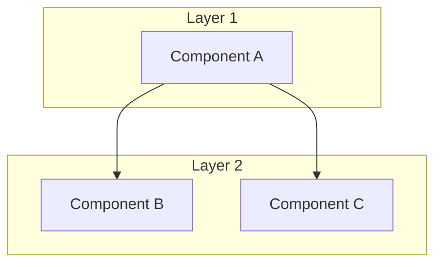
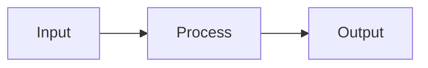
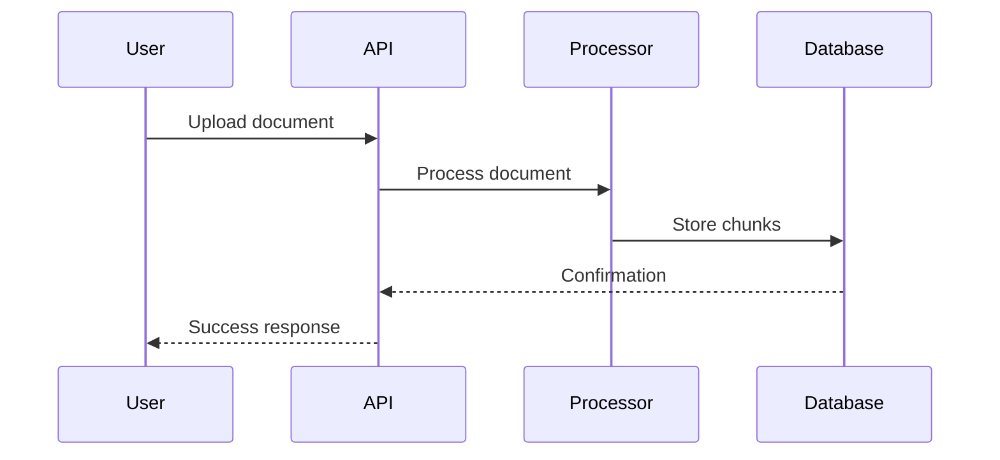

# Architectural Review Skill

## Purpose

Perform comprehensive architectural reviews of codebases, generating detailed documentation of system design, capabilities, gaps, and test plans.

---

## Trigger Phrases

Use this skill when the user asks for:
- "architectural review"
- "architecture assessment"
- "codebase analysis"
- "system design review"
- "technical audit"
- "code architecture documentation"
- "full system analysis"

---

## Process

### Phase 1: Discovery

1. **Identify project scope**
   ```bash
   # Find all source files
   find . -name "*.py" -o -name "*.js" -o -name "*.ts" -o -name "*.go" -o -name "*.rs" | head -100
   
   # Check for config files
   ls -la *.json *.yaml *.yml *.toml pyproject.toml package.json Cargo.toml go.mod 2>/dev/null
   
   # Check for documentation
   ls -la README* CHANGELOG* docs/ 2>/dev/null
   ```

2. **Read all source files**
   - Start with entry points (main.py, app.py, index.js, main.go)
   - Follow imports to understand dependencies
   - Read configuration files
   - Read existing documentation

3. **Map the codebase structure**
   - Directory organization
   - Module dependencies
   - Entry points
   - Configuration sources

### Phase 2: Analysis

1. **Data Models**
   - Identify all data classes, types, schemas
   - Document fields and relationships
   - Note validation rules

2. **Data Stores**
   - Databases (SQL, NoSQL, vector stores)
   - File storage
   - Caches
   - External services

3. **APIs & Integrations**
   - External API calls
   - Internal API endpoints
   - Message queues
   - Webhooks

4. **Processing Pipelines**
   - Data flow from input to output
   - Transformation steps
   - Error handling paths

5. **UI/UX Components** (if applicable)
   - Pages/routes
   - Components
   - State management

### Phase 3: Assessment

1. **Capabilities Matrix**
   - List all features
   - Rate implementation status: ✅ Complete, ⚠️ Partial, ❌ Missing, 🔄 In Progress

2. **Gap Analysis**
   - Missing functionality
   - Incomplete implementations
   - Dead code
   - TODO/FIXME comments

3. **Risk Assessment**
   - Security concerns
   - Performance bottlenecks
   - Scalability limits
   - Single points of failure
   - Technical debt

4. **Code Quality**
   - Consistency
   - Error handling
   - Logging
   - Documentation coverage
   - Test coverage

### Phase 4: Test Plan

1. **Unit Tests**
   - List functions/methods needing tests
   - Identify edge cases
   - Mock requirements

2. **Integration Tests**
   - Component interaction scenarios
   - Data flow validation
   - API contract tests

3. **End-to-End Tests**
   - User journey scenarios
   - Critical path tests
   - Failure recovery tests

### Phase 5: Documentation

Generate comprehensive markdown document with all findings.

---

## Output Template

```markdown
# Architecture Review: [PROJECT NAME]

**Review Date:** [DATE]
**Reviewer:** Claude Code
**Codebase Version:** [GIT COMMIT or VERSION]

---

## Executive Summary

[2-3 paragraph overview of the system, its purpose, current state, and key findings]

### Key Metrics

| Metric | Value |
|--------|-------|
| Total Source Files | X |
| Lines of Code | X |
| External Dependencies | X |
| API Integrations | X |
| Data Stores | X |
| Test Coverage | X% |

### Critical Findings

1. [Most important finding]
2. [Second most important]
3. [Third most important]

---

## System Overview

### Purpose

[What the system does, who uses it, what problem it solves]

### Architecture Diagram



### Technology Stack

| Layer | Technology |
|-------|------------|
| Language | Python 3.x |
| Framework | Streamlit |
| Database | LanceDB |
| Vector Store | Voyage AI |
| LLM | Claude API |

### Directory Structure

```
project/
├── src/
│   ├── main.py
│   └── ...
├── data/
├── config/
└── tests/
```

---

## Component Deep Dive

### Component 1: [Name]

**Purpose:** [What it does]

**Location:** `path/to/file.py`

**Key Functions:**

| Function | Purpose | Status |
|----------|---------|--------|
| `function_a()` | Does X | ✅ |
| `function_b()` | Does Y | ⚠️ |

**Dependencies:**
- Depends on: Component X, Component Y
- Depended on by: Component Z

**Data Flow:**


**Issues Identified:**
- Issue 1
- Issue 2

---

### Component 2: [Name]

[Repeat structure for each major component]

---

## Data Models

### Model 1: [Name]

```python
{
    "id": "string",
    "field1": "type",
    "field2": "type",
    ...
}
```

**Relationships:**
- Has many: [Related model]
- Belongs to: [Parent model]

**Validation:**
- field1: required, max length 100
- field2: optional, enum values [a, b, c]

---

## Data Flow Analysis

### Flow 1: [Name] (e.g., "Document Ingestion")



**Steps:**
1. Step 1 description
2. Step 2 description
3. Step 3 description

**Error Handling:**
- Error case 1: [How handled]
- Error case 2: [How handled]

---

## Current Capabilities Matrix

| Feature | Status | Notes |
|---------|--------|-------|
| Feature 1 | ✅ Complete | Works as expected |
| Feature 2 | ⚠️ Partial | Missing edge case handling |
| Feature 3 | ❌ Missing | Not implemented |
| Feature 4 | 🔄 In Progress | 60% complete |

### Legend
- ✅ Complete: Fully implemented and working
- ⚠️ Partial: Implemented but has issues or missing features
- ❌ Missing: Not implemented
- 🔄 In Progress: Currently being developed

---

## Gap Analysis

### Functional Gaps

| Gap | Impact | Priority | Recommendation |
|-----|--------|----------|----------------|
| Gap 1 | High | P1 | Fix immediately |
| Gap 2 | Medium | P2 | Fix in next sprint |
| Gap 3 | Low | P3 | Backlog |

### Technical Gaps

| Gap | Impact | Priority | Recommendation |
|-----|--------|----------|----------------|
| Missing error handling in X | High | P1 | Add try/catch |
| No logging in Y | Medium | P2 | Add structured logging |

### Integration Gaps

| Gap | Impact | Priority | Recommendation |
|-----|--------|----------|----------------|
| API X not connected | High | P1 | Implement integration |

---

## Risk Assessment

### High Risk

| Risk | Likelihood | Impact | Mitigation |
|------|------------|--------|------------|
| Risk 1 | High | High | Mitigation strategy |

### Medium Risk

| Risk | Likelihood | Impact | Mitigation |
|------|------------|--------|------------|
| Risk 2 | Medium | Medium | Mitigation strategy |

### Low Risk

| Risk | Likelihood | Impact | Mitigation |
|------|------------|--------|------------|
| Risk 3 | Low | Low | Mitigation strategy |

---

## Test Plan

### Unit Tests

| Component | Function | Test Cases | Priority |
|-----------|----------|------------|----------|
| Component A | function_a | Normal, Empty input, Large input, Invalid type | P1 |
| Component A | function_b | Normal, Edge case 1, Edge case 2 | P2 |

### Integration Tests

| Test Scenario | Components | Expected Outcome | Priority |
|---------------|------------|------------------|----------|
| Scenario 1 | A → B → C | Data flows correctly | P1 |
| Scenario 2 | B ↔ D | Bidirectional sync works | P1 |

### End-to-End Tests

| User Journey | Steps | Expected Outcome | Priority |
|--------------|-------|------------------|----------|
| Journey 1 | 1. Do X, 2. Do Y, 3. Do Z | User achieves goal | P1 |
| Journey 2 | 1. Do A, 2. Do B | User achieves goal | P2 |

### Test Coverage Goals

| Component | Current | Target |
|-----------|---------|--------|
| Component A | 0% | 80% |
| Component B | 0% | 70% |

---

## Recommended Improvements

### Immediate (P1)

1. **[Improvement 1]**
   - Problem: [Description]
   - Solution: [Description]
   - Effort: [Hours/Days]
   - Impact: [Description]

2. **[Improvement 2]**
   - Problem: [Description]
   - Solution: [Description]
   - Effort: [Hours/Days]
   - Impact: [Description]

### Short-term (P2)

1. **[Improvement 3]**
   - Problem: [Description]
   - Solution: [Description]
   - Effort: [Hours/Days]
   - Impact: [Description]

### Long-term (P3)

1. **[Improvement 4]**
   - Problem: [Description]
   - Solution: [Description]
   - Effort: [Hours/Days]
   - Impact: [Description]

---

## Appendix

### A. File Reference

| File | Purpose | Lines | Dependencies |
|------|---------|-------|--------------|
| main.py | Entry point | 500 | streamlit, pandas |
| utils.py | Utilities | 200 | - |

### B. Function Reference

| Function | File | Purpose | Complexity |
|----------|------|---------|------------|
| main() | main.py | Entry point | Low |
| process() | utils.py | Processing | Medium |

### C. Configuration Reference

| Config | File | Purpose |
|--------|------|---------|
| API_KEY | .env | Claude API key |
| DB_PATH | config.yaml | Database location |

### D. External Dependencies

| Package | Version | Purpose | License |
|---------|---------|---------|---------|
| streamlit | 1.x | UI framework | Apache 2.0 |
| lancedb | 0.x | Vector store | Apache 2.0 |

### E. TODO/FIXME Items Found

| Location | Type | Description |
|----------|------|-------------|
| main.py:123 | TODO | Implement caching |
| utils.py:45 | FIXME | Handle edge case |

---

## Revision History

| Date | Reviewer | Changes |
|------|----------|---------|
| [DATE] | Claude Code | Initial review |
```

---

## Usage Instructions

### For Claude Code

When asked to perform an architectural review:

1. **Read this skill file first**

2. **Execute discovery phase**
   ```
   I'll start by mapping the codebase structure and reading all source files.
   ```

3. **Analyze systematically**
   - Don't skip components
   - Document everything found
   - Note uncertainties

4. **Generate comprehensive output**
   - Use the template above
   - Fill in all sections
   - Include mermaid diagrams
   - Be specific with file paths and line numbers

5. **Save output**
   ```
   Save to: /mnt/user-data/outputs/ARCHITECTURE_REVIEW.md
   ```

### For Users

To trigger this skill, say:

```
Do a full architectural review of my codebase. 
Read all source files and generate a comprehensive 
architecture document following the architectural review skill.
```

Or more specifically:

```
Using the architectural review skill:

1. Read all Python files in this project
2. Analyze the architecture
3. Document capabilities and gaps
4. Create a test plan
5. Output to ARCHITECTURE_REVIEW.md
```

---

## Quality Checklist

Before finalizing the review, verify:

- [ ] All source files were read
- [ ] All components documented
- [ ] Data flow diagrams included
- [ ] Capabilities matrix complete
- [ ] Gap analysis has priorities
- [ ] Risk assessment included
- [ ] Test plan is actionable
- [ ] Recommendations are specific
- [ ] File/function appendix complete
- [ ] Mermaid diagrams render correctly
